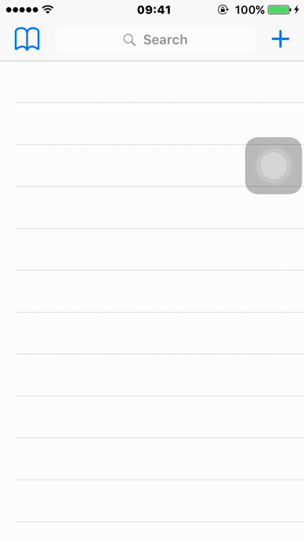
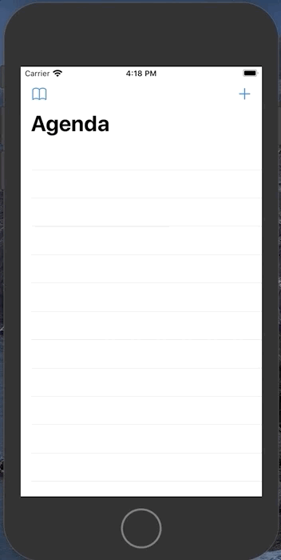

# Curso de iOS parte 01: Usando recursos nativos

Este é meu código durante o curso de iOS.

:spiral_notepad: :pencil2: Anotações durante o curso, podem ser vistas [AQUI](https://marcoaurelio.slite.com/api/s/note/9axXLv2wr2oo5a2Qt38oYU/iOS-Recursos-Nativos-01)

## Aula 01: Acessando a câmera do iPhone/iPad Ver primeiro vídeo
- [Introdução](https://github.com/aureliomarco/alura-ios-recursos-nativos-part-01/commit/386d6cafc027fe96190f8bc9271a0c1f2604d27e) - commit [fb4e01d7713bce9b24b6e8f7fba015a809e4599a]
- [Utilizando a câmera](https://github.com/aureliomarco/alura-ios-recursos-nativos-part-01/commit/386d6cafc027fe96190f8bc9271a0c1f2604d27e) - commit [386d6cafc027fe96190f8bc9271a0c1f2604d27e]

  

- [Utilizando a biblioteca de fotos](https://github.com/aureliomarco/alura-ios-recursos-nativos-part-01/commit/fe96bc94b0a2d3a2e8e14e25166e80aa378af591) - commit [fe96bc94b0a2d3a2e8e14e25166e80aa378af591]

  

## Aula 02: Persistindo dados com Core Data
- [Começando com o Core Data, Salvando alunos no device](https://github.com/aureliomarco/alura-ios-recursos-nativos-part-01/commit/f300a62bc0cecd4e00aba9f8246a02ddf185afd6) - commit [f300a62bc0cecd4e00aba9f8246a02ddf185afd6]
- [Listando os alunos](https://github.com/aureliomarco/alura-ios-recursos-nativos-part-01/commit/416d10cb086d5480d12fc3cdfad49f0492c13c78) - commit [416d10cb086d5480d12fc3cdfad49f0492c13c78]
- [Ajuste na listagem dos alunos](https://github.com/aureliomarco/alura-ios-recursos-nativos-part-01/commit/3b4cd80f5fc12356f96315557fe95d168ff17c11) - commit [3b4cd80f5fc12356f96315557fe95d168ff17c11]
- Editando informações dos alunos
- Deletando aluno

## Aula 03: Trabalhando com recursos nativos
- Criando o menu opções
- Componente de mensagem do iOS
- Ligação telefônica

## Aula 04: Utilizando localização e mapa
- Integração com o waze
- Trabalhando com o mapa nativo
- Configurando mapa

## Aula 05: Requisições HTTP
- Requisição http
- Exibindo a média dos alunos
- Conclusão

